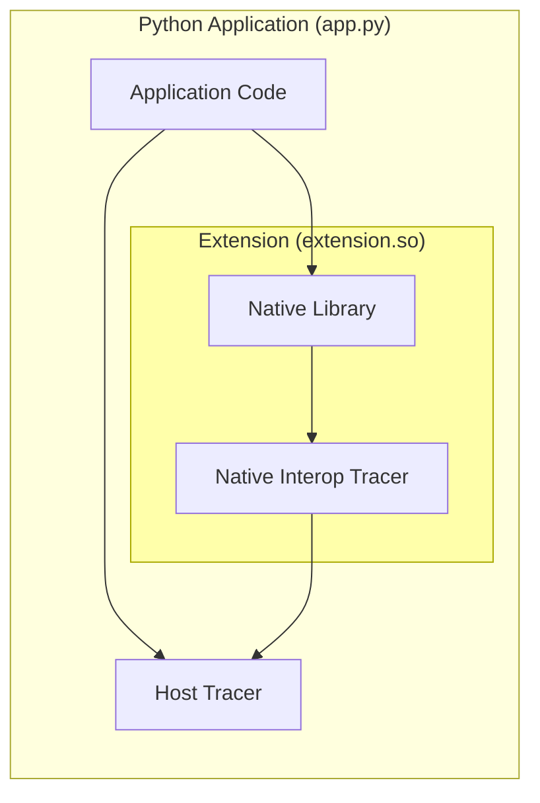
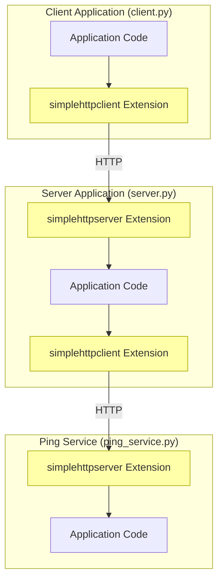

# OpenTracing C++/Python interoperability proof of concept

## Summary

This PoC (proof of concept) describes how OpenTracing can be supported in an environment that mixes a Python with native extensions that utilise the native C++ implementation, which will be referred to as a **mixed platform** application environment. These ideas apply to other scenarios such as native Node.js modules or even across tightly coupled process barriers (e.g. fork/exec).

The term **platform** in this document refers to the application code executed within a specific environment. For example, C++ code which is compiled and executed natively, Python code interpreted and executed by the Python interpreter or Java code which is compiled and executed by the JVM. The term is NOT used to refer to the executing runtime (Python interpreter or JVM). This PoC does not require any changes or tracing support from any executing runtime and applies only to the tracing frameworks, in this case OpenTracing.

## Background Reading

This POC builds upon the concepts described in the [OpenTracing Specification](https://opentracing.io/specification/) and requires an understanding of Distributed Tracing. The book [Mastering Distributed Tracing](https://www.oreilly.com/library/view/mastering-distributed-tracing/9781788628464/) is a great resource for learning about Distributed Tracing fundamentals.

The components are written in either C++, Python or Cython for the mixed platform extension. The majority of the interoperability is developed in C++ and Cython, and a basic understanding of these languages is required. For an overview of Cython, please see the [Cython - Getting Started](https://cython.readthedocs.io/en/latest/src/quickstart/) section.

## Requirements

### Mixed platform applications produce similar-looking traces to single platform applications

An application written entirely in Python, or in C++, will often create only one `span` when handling a single request. In such a case both the libraries and application code may interact with this span. We will likewise expect that a span created in a mixed platform environment, e.g. in a C++ library, can be passed to Python and both platforms can interact with the span. In contrast, an implementation that creates two separate spans for each platform which reference each other would not be desired as this would change the behaviour of how an application is traced.

To satisfy this requirement, it is expected that active spans within a Tracer's ScopeManager are propagated between platforms and further collection of tracing data can continue in the next platform.

### Application and libraries rely only on standard tracing APIs

In the case of a native Python extension, we expect that a C++ library linked in by the extension will only use the standard C++ tracing APIs and will not be aware of any interoperability layer. The extension itself is expected to provide interoperability behaviour.

### Host platform owns the tracing implementation

Tracing interfaces such as OpenTracing enable the application to override the tracing implementation, such as loading a vendor-specific `Tracer` which handles tracing data. The host platform, in this example Python, will retain the ability to decide which implementation to use, and all extensions are expected to use this implementation.

### Performance impact of interoperability is understood and is not significant

Although difficult to quantify in absolute terms, it is expected that the tracing implementation avoids significant degradations in performance. In essence, implementations that for example synchronously cross-platform barriers for tracing API calls would be avoided. E.g. setting a tag in C++ would avoid invoking Python code synchronously.

### Multiple interoperable components can work simultaneously

In this example, multiple Python extensions can be loaded into the Python interpreter and are expected to continue to function. This would include extensions that may have been built with different but compatible tracing versions and may even share some runtime components, such as the same `.so`/`.DLL`.

## Design Considerations

### Tracing effects are deterministic or observable

It is expected that some tracing operations are deterministic and can be implemented on both platforms consistently. This includes:
- SpanContext Definition (e.g. length and format of SpanID and TraceID)
- SpanContext creation on Span creation
- Injection
- Extraction

The current OpenTracing specification allows these to be overwritten by the Tracer implementation. For the purpose of this PoC, a new library has been introduced `w3copentracing` which provides a concrete implementation of SpanContext definition and injection/extraction compliant with the [W3C Trace Context](https://www.w3.org/TR/trace-context-1/) specification. These have been provided for both platforms [w3copentracing-python](https://github.com/eyjohn/w3copentracing-python) and [w3copentracing-cpp](https://github.com/eyjohn/w3copentracing-cpp) which is used for the C++ library as opposed to the standard OpenTracing APIs.

The creation of SpanContext during Span creation has been implemented consistently using a common approach of Trace continuation, i.e. if a Span is created for a new Trace then both IDs are randomly generated, whereas if a Span continues from existing traces then it will inherit the TraceID of the first parent. This is behaviour is presumed and implemented in the interoperability layer.

This approach will avoid the C++ libraries from relying on the Python tracer implementation for all operations except for the "collection" which is expected to be implemented by the specific Tracer implementation. Any further behaviour which needs to be mimicked in C++ should either be standardised, or observable (for example exposing a flag on the ScopeManager's scope about whether the span should be closed).

### Tracing calls are write-only

Except for any operations highlighted above, all calls to Tracing APIs are expected to be write-only. For example, setting tags or adding logs to a Span is a write-only operation and can not be observed, i.e. it is not possible to check what tags are set on a span using Tracing APIs.

The exceptions to this are interactions with the SpanContext such as injection which requires fields from the SpanContext to be read and used by the carrier.

### Tracing collection can be deferred

It is expected that write-only calls to Tracing APIs do not have to be reported to the tracer immediately, and can be invoked on the tracer at a later time. The exception to this is timestamp observation which is expected to occur at the time of the API invocation and not at the time of collection.

This includes the creation of new Spans, i.e. the action of creating the span on the host platform's Tracer does not have to occur immediately and can be deferred, however, it is expected that a valid Span is returned which allows further API calls to be recorded for future collection.

Deterministic behaviour such as setting SpanContext identifiers is expected to occur immediately and will not be deferred.

The interoperability layer is expected to define when collection should occur. For example, this could be at the time that one platform invokes another, or perhaps at a scheduled interval.

### Scope propagation creates "proxy" spans when crossing platforms

A span created within one platform that is propagated into another will create a new "proxy" Span object which mimics the original span and allows further collection of tracing data. It is possible for a span created from a guest platform can create a "real" span on the host platform rather than a "proxy" span, however, in the reverse direction the guest platform is unable to own the real span and can use a "proxy" span. Such a "proxy" span is expected to have a valid context that can be injected or referenced by child spans.

## Component Overview


<details><summary>Mermaid Code</summary>
<p>



</p>
</details>

This PoC provides an example of two extensions: HTTP Client and Server which demonstrate the following capabilities:

| Capability | Client Extension | Server Extension |
| - | - | - |
| Span Creation | N/A | Creates Native Span when handling Requests |
| Scope Propagation | Python Scope is preserved into extension | Native Span is propagated as Scope into Python |
| Carrier | Active Span's context is injected into request | A context is read from the request if present and used as the parent in the new Span |
| Instrumentation | Tags are set on the active Span in the extension | Tags are set on Native Span |
| Collection | Tracing data is collected when the request is complete | Collection happens at the end of request handling |

### Interop Tracer

The "Interop" (Interoperability) Tracer is the main glue that provides the Tracer functionality to the guest platform (SpanContext creation, injection, extraction) as well as collecting the calls to the Tracing API for propagation to the host platform's Tracer.

The implementation of such a Tracer which simply caches tracing calls until they are collected can be found here: [otinterop_tracer.h](https://github.com/eyjohn/simplehttpclient-python/blob/66482d201212be2efe9fc44f82703f2304cb529f/src/otinterop_tracer.h) | [otinterop_tracer.cpp](https://github.com/eyjohn/simplehttpclient-python/blob/66482d201212be2efe9fc44f82703f2304cb529f/src/otinterop_tracer.cpp)

### Trace Collection

The Extension is expected to determine when the collection should occur but is required to propagate at least the SpanContext of the active Span immediately presuming an active span is propagated.

The Client extension collects the tracing data at the end of the request handling (after exiting the Native library stack), as shown here: [Client Extension: ext.pyx](https://github.com/eyjohn/simplehttpclient-python/blob/66482d201212be2efe9fc44f82703f2304cb529f/simplehttpclient/ext.pyx#L126). It is expected that all tracing calls have been completed by the native library by this point and no further tracing data will be collected for the current span in the native library.

The Server extension has different requirements as the Span is created, and populated before invoking the Python code and is closed after the Python code has been invoked. As a result, collection happens in multiple places:

- [At the start of request handling: ext.pyx](https://github.com/eyjohn/simplehttpserver-python/blob/f3ac55487ce4c8b728cdc65840035abebbe9da67/simplehttpserver/ext.pyx#L103) - this is required to observe the Span created by the Native library and propagate it into Python as the active Span.
- The above also occurs upon subsequent requests, which will collect any tracing data since the last collection, in this case, it will capture any tags/logs set during the Python span and the `finish()` of the previous span.
- [At the server termination: ext.pyx](https://github.com/eyjohn/simplehttpserver-python/blob/f3ac55487ce4c8b728cdc65840035abebbe9da67/simplehttpserver/ext.pyx#L131) - When the server closes, any remaining uncollected tracing data is collected (i.e. the `finish()` of the last Span).

*NOTE: To prevent long-hanging Spans for which the finish may not be reported for a long time, it may be better to poll the collection of tracing at regular intervals.*

### Trace Propagation

To active Span is propagated between the platforms whenever one platform calls into another.

For the Client extension, this happens just before the Python extension invokes the native library in [Client Extension: ext.pyx](https://github.com/eyjohn/simplehttpclient-python/blob/029bd89957a5a03ae943860f333f6a9c71ea0cc6/simplehttpclient/ext.pyx#L105). This creates a "proxy" span which mimics the Python Span allowing it to be injected and to collect further tracing data.

The Server extension does the reverse operation by checking the native ScopeManager for a span and propagating it into python in [Server Extension: ext.pyx:110](https://github.com/eyjohn/simplehttpserver-python/blob/f3ac55487ce4c8b728cdc65840035abebbe9da67/simplehttpserver/ext.pyx#L110). However, in this case, the Span which was not created in Python is expected to be observed before it can be propagated, this is achieved by triggering the collection before propagating the scope in here [Server Extension: ext.pyx:103](https://github.com/eyjohn/simplehttpserver-python/blob/f3ac55487ce4c8b728cdc65840035abebbe9da67/simplehttpserver/ext.pyx#L103).

## Test Scenario

![Test Scenario Diagram](https://mermaid.ink/img/eyJjb2RlIjoiZ3JhcGggVEJcbnN1YmdyYXBoIGNsaWVudGFwcFtcIkNsaWVudCBBcHBsaWNhdGlvbiAoY2xpZW50LnB5KVwiXVxuICAgIGNsaWVudGFwcF9jb2RlW0FwcGxpY2F0aW9uIENvZGVdXG4gICAgY2xpZW50YXBwX2V4dGVuc2lvbl9jbGllbnRbc2ltcGxlaHR0cGNsaWVudCBFeHRlbnNpb25dXG4gICAgY2xpZW50YXBwX2NvZGUgLS0-IGNsaWVudGFwcF9leHRlbnNpb25fY2xpZW50XG5lbmRcbnN0eWxlIGNsaWVudGFwcF9leHRlbnNpb25fY2xpZW50IGZpbGw6I0ZGQSxzdHJva2U6I0FBMFxuc3ViZ3JhcGggc2VydmVyYXBwW1wiU2VydmVyIEFwcGxpY2F0aW9uIChzZXJ2ZXIucHkpXCJdXG4gICAgc2VydmVyYXBwX2NvZGVbQXBwbGljYXRpb24gQ29kZV1cbiAgICBzZXJ2ZXJhcHBfZXh0ZW5zaW9uX2NsaWVudFtzaW1wbGVodHRwY2xpZW50IEV4dGVuc2lvbl1cbiAgICBzZXJ2ZXJhcHBfZXh0ZW5zaW9uX3NlcnZlcltzaW1wbGVodHRwc2VydmVyIEV4dGVuc2lvbl1cbiAgICBzZXJ2ZXJhcHBfZXh0ZW5zaW9uX3NlcnZlciAtLT4gc2VydmVyYXBwX2NvZGUgLS0-IHNlcnZlcmFwcF9leHRlbnNpb25fY2xpZW50XG5lbmRcbnN0eWxlIHNlcnZlcmFwcF9leHRlbnNpb25fY2xpZW50IGZpbGw6I0ZGQSxzdHJva2U6I0FBMFxuc3R5bGUgc2VydmVyYXBwX2V4dGVuc2lvbl9zZXJ2ZXIgZmlsbDojRkZBLHN0cm9rZTojQUEwXG5cbnN1YmdyYXBoIHBpbmdzZXJ2aWNlW1wiUGluZyBTZXJ2aWNlIChwaW5nX3NlcnZpY2UucHkpXCJdXG4gICAgcGluZ3NlcnZpY2VfY29kZVtBcHBsaWNhdGlvbiBDb2RlXVxuICAgIHBpbmdzZXJ2aWNlX2V4dGVuc2lvbl9zZXJ2ZXJbc2ltcGxlaHR0cHNlcnZlciBFeHRlbnNpb25dXG4gICAgcGluZ3NlcnZpY2VfZXh0ZW5zaW9uX3NlcnZlciAtLT4gcGluZ3NlcnZpY2VfY29kZVxuZW5kXG5zdHlsZSBwaW5nc2VydmljZV9leHRlbnNpb25fc2VydmVyIGZpbGw6I0ZGQSxzdHJva2U6I0FBMFxuXG5cbmNsaWVudGFwcF9leHRlbnNpb25fY2xpZW50IC0tPiB8SFRUUHwgc2VydmVyYXBwX2V4dGVuc2lvbl9zZXJ2ZXJcbnNlcnZlcmFwcF9leHRlbnNpb25fY2xpZW50IC0tPiB8SFRUUHwgcGluZ3NlcnZpY2VfZXh0ZW5zaW9uX3NlcnZlclxuIiwibWVybWFpZCI6eyJ0aGVtZSI6Im5ldXRyYWwifX0)

<details><summary>Mermaid Code</summary>
<p>



</p>
</details>


The scenario used in this PoC attempts to tackle many of the different operations including the following:
- Creating Span in Python and propagating into C++ (e.g. in `client.py`)
  - Adding tags on this span in C++ (e.g. in [libsimplehttp](https://github.com/eyjohn/libsimplehttp))
  - Injecting the SpanContext in C++ (e.g. in [libsimplehttp](https://github.com/eyjohn/libsimplehttp))
- Creating Span in C++ (`server.py`) and propagating it into Python (e.g. in `server.py`)
  - Accepting further tags in Python [server.py:26](https://github.com/eyjohn/otinterop/blob/6a197ab4183ec381d47f163c0decfc680d5e7d51/server.py#L26)
  - Propagating this Span back into C++ (into simplehttpclient)

## Outcome

The following spans were generated when executing a single request in the scenario described above:

### `client.py` Spans

```python
# Created by Python application code
{
  'context': SpanContext(trace_id = '732AF76DCF2843203250BC61441C8894', span_id = 'AAAD2F8051E7231D', sampled = True, baggage = {
    'key': 'val' # Set by Python app code when starting the trace
  }),
  'operation_name': 'client',
  'references': [],
  'tags': {
    'http_status': 200 # Set by C++ code in extension
  },
  'logs': [],
  'start_time': 1579006706.5321116, # Started in Python
  'finish_time': 1579006706.5531337 # Ended in Python
}
```

### `server.py` Spans


```python
# Created by C++ server extension code
{
  'context': SpanContext(trace_id = '732AF76DCF2843203250BC61441C8894', span_id = 'C82DDAB4D840EF5A', sampled = True, baggage = {
    'key': 'val'
  }),
  'operation_name': 'simplehttpserver.handlerequest',
  'references': [Reference(type = 'child_of', referenced_context = SpanContext(trace_id = '732AF76DCF2843203250BC61441C8894', span_id = 'AAAD2F8051E7231D', sampled = True, baggage = {
    'key': 'val'
  }))], # Injected and extracted in C++ code
  'tags': {
    'target': '/hello', # Set by C++ server extension code
    'http_status': 200, # Set by C++ client extension code
    'app_tag': 'value'  # Set by Python application code
  },
  'logs': [],
  'start_time': 1579006706.5438802, # Started in C++
  'finish_time': 1579006706.5522382 # Ended in C++
}
```

### `ping_servie.py` Spans

```python
# Created by C++ server extension code
{
  'context': SpanContext(trace_id = '732AF76DCF2843203250BC61441C8894', span_id = '55BE61E775077D25', sampled = True, baggage = {
    'key': 'val'
  }),
  'operation_name': 'simplehttpserver.handlerequest',
  'references': [Reference(type = 'child_of', referenced_context = SpanContext(trace_id = '732AF76DCF2843203250BC61441C8894', span_id = 'C82DDAB4D840EF5A', sampled = True, baggage = {
    'key': 'val'
  }))], # Injected and extracted in C++ code
  'tags': {
    'target': '/ping' # Set by C++ Server Code
  },
  'logs': [],
  'start_time': 1579006706.5502484, # Started in c++
  'finish_time': 1579006706.5506222 # Ended in c++
}
```

## Unresolved issues

### Delayed collection of `finish()` of server Span

The `finish()` of the C++ created Span is not currently collected until the next request or the application shut-down, leading to potentially delayed span collection. This could be mitigated by collecting tracing data at regular intervals in addition to upon request handling.

### Multiple `finish()` invocations for propagated Spans

A Span originating in one platform and being propagated into another may have finish invoked by both platforms, as both will currently "close" the span. This can be addressed by either:
1. Preventing a platform form closing spans that originated from another platform
2. **Preferred** Propagate the span closing behaviour using the Scope object, allowing the scope to trigger the `finish()` (or not). This behaviour would need to be observable on the Scope object.
