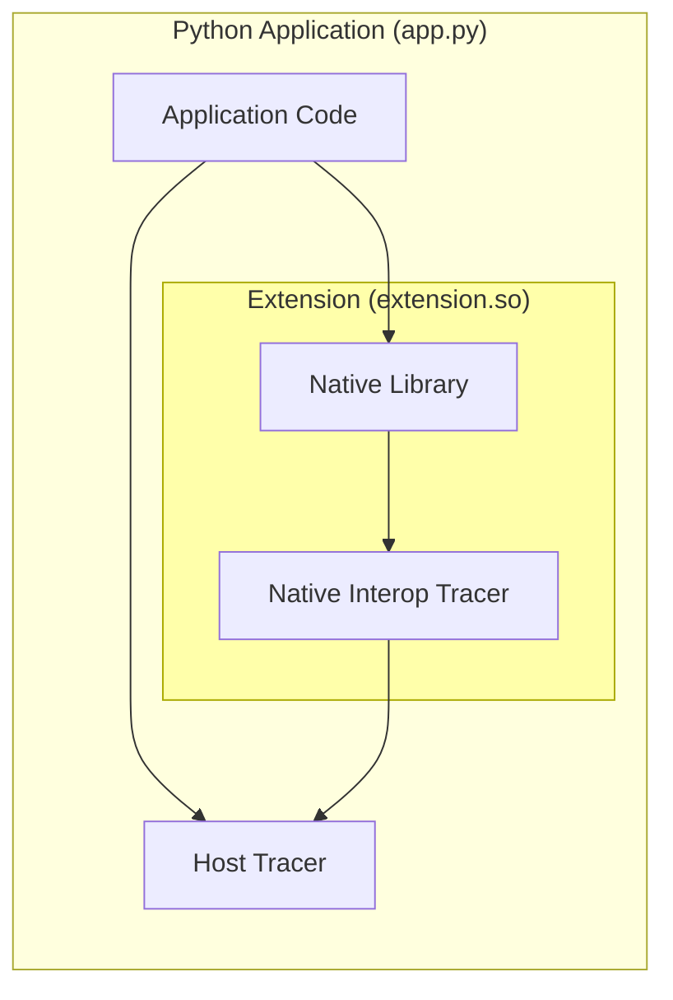

# OpenTracing C++/Python interoperability proof of concept

## Summary

This POC (proof of concept) describes how OpenTracing can be supported in an environment that mixes a Python with native extensions that utilise the native C++ implementation, which will be referred to as a **mixed platform** application environment. These ideas apply to other scenarios such as native Node.js modules or even across tightly coupled process barriers (e.g. fork/exec).

## Background Reading

This POC builds upon the concepts described in the [OpenTracing Specification](https://opentracing.io/specification/) and requires an understanding of Distributed Tracing. The book [Mastering Distributed Tracing](https://www.oreilly.com/library/view/mastering-distributed-tracing/9781788628464/) is a great resource for learning about Distributed Tracing fundamentals.

## Requirements

### Mixed platform applications produce similar-looking traces to single platform applications

An application written entirely in Python, or in C++, will often create only one `span` when handling a single request. In such a case both the libraries and application code may interact with this span. We will likewise expect that a span created in a mixed platform environment, e.g. in a C++ library, can be passed to Python and both platforms can interact with the span. In contrast, an implementation that creates two separate spans for each platform which reference each other would not be desired as this would change the behaviour of how an application is traced.

To satisfy this requirement, it is expected that active spans within a Tracer's ScopeManager are propagated between platforms and further collection of tracing data can continue in the next platform.

### Application and libraries rely only on standard tracing APIs

In the case of a native Python extension, we expect that a C++ library linked in by the extension will only use the standard C++ tracing APIs and will not be aware of any interoperability layer. The extension itself is expected to provide interoperability behaviour.

### Host platform owns the tracing implementation

Tracing interfaces such as OpenTracing enable the application to override the tracing implementation, such as loading a vendor-specific `Tracer` which handles tracing data. The host platform, in this example Python, will retain the ability to decide which implementation to use, and all extensions are expected to use this implementation.

### Performance impact of interoperability is understood and is not significant

Although difficult to quantify in absolute terms, it is expected that the tracing implementation avoids significant degradations in performance. In essence, implementations that for example synchronously cross-platform barriers for tracing API calls would be avoided. E.g. setting a tag in C++ would avoid invoking Python code synchronously.

### Multiple interoperable components can work simultaneously

In this example, multiple Python extensions can be loaded into the Python interpreter and are expected to continue to function. This would include extensions that may have been built with different but compatible tracing versions and may even share some runtime components, such as the same `.so`/`.DLL`.

## Design Considerations

### Tracing effects are deterministic or observable

It is expected that some tracing operations are deterministic and can be implemented on both platforms consistently. This includes:
- SpanContext Definition (e.g. length and format of SpanID and TraceID)
- SpanContext creation on Span creation
- Injection
- Extraction

The current OpenTracing specification allows these to be overwritten by the Tracer implementation. For the purpose of this proof of concept, a new library has been introduced `w3copentracing` which provides a concrete implementation of SpanContext definition and injection/extraction compliant with the [W3C Trace Context](https://www.w3.org/TR/trace-context-1/) specification. These have been provided for both platforms [w3copentracing-python](https://github.com/eyjohn/w3copentracing-python) and [w3copentracing-cpp](https://github.com/eyjohn/w3copentracing-cpp) which is used for the C++ library as opposed to the standard OpenTracing APIs.

The creation of SpanContext during Span creation has been implemented consistently using a common approach of Trace continuation, i.e. if a Span is created for a new Trace then both IDs are randomly generated, whereas if a Span continues from existing traces then it will inherit the TraceID of the first parent. This is behaviour is presumed and implemented in the interoperability layer.

This approach will avoid the C++ libraries from relying on the Python tracer implementation for all operations except for the "collection" which is expected to be implemented by the specific Tracer implementation. Any further behaviour which needs to be mimicked in C++ should either be standardised, or observable (for example exposing a flag on the ScopeManager's scope about whether the span should be closed).

### Tracing calls are write-only

Except for any operations highlighted above, all calls to Tracing APIs are expected to be write-only. For example, setting tags or adding logs to a Span is a write-only operation and can not be observed, i.e. it is not possible to check what tags are set on a span using Tracing APIs.

The exceptions to this are interactions with the SpanContext such as injection which requires fields from the SpanContext to be read and used by the carrier.

### Tracing collection can be deferred

It is expected that write-only calls to Tracing APIs do not have to be reported to the tracer immediately, and can be invoked on the tracer at a later time. The exception to this is timestamp observation which is expected to occur at the time of the API invocation and not at the time of collection.

This includes the creation of new Spans, i.e. the action of creating the span on the host platform's Tracer does not have to occur immediately and can be deferred, however, it is expected that a valid Span is returned which allows further API calls to be recorded for future collection.

Deterministic behaviour such as setting SpanContext identifiers is expected to occur immediately and will not be deferred.

The interoperability layer is expected to define when collection should occur. For example, this could be at the time that one platform invokes another, or perhaps at a scheduled interval.

### Scope propagation creates "proxy" spans when crossing platforms

A span created within one platform that is propagated into another will create a new "proxy" Span object which mimics the original span and allows further collection of tracing data. It is possible for a span created from a guest platform can create a "real" span on the host platform rather than a "proxy" span, however, in the reverse direction the guest platform is unable to own the real span and can use a "proxy" span. Such a "proxy" span is expected to have a valid context that can be injected or referenced by child spans.

## Component Overview

Mermaid Code

### Interop Tracer

The "Interop" (Interoperability) Tracer is the main glue that provides the Tracer functionality to the guest platform (SpanContext creation, injection, extraction) as well as collecting the calls to the Tracing API for propagation to the host platform's Tracer.

The implementation of such a Tracer which simply caches tracing calls until they are collected can be found here: [`otinterop_trace.h`](https://github.com/eyjohn/simplehttpclient-python/blob/master/src/otinterop_tracer.h) | [`otinterop_trace.cpp`](https://github.com/eyjohn/simplehttpclient-python/blob/master/src/otinterop_tracer.cpp)

### Trace Collection

The Extension is expected to determine when the collection should occur but is required to propagate at least the SpanContext of the active Span immediately presuming an active span is propagated.

This proof of concept provides an example of the collection logic implemented for both a client and server version of the library and demonstrates how .... TODO

## Test Scenario

client -> server -> ping_service

### Span Collections

### Active Span propagation

## Outcome

## Unresolved issues
